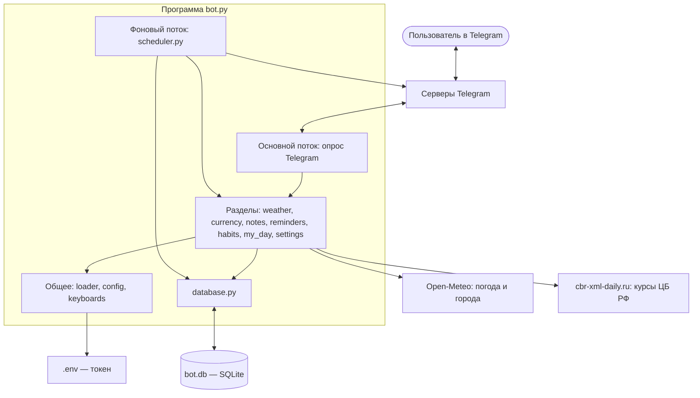
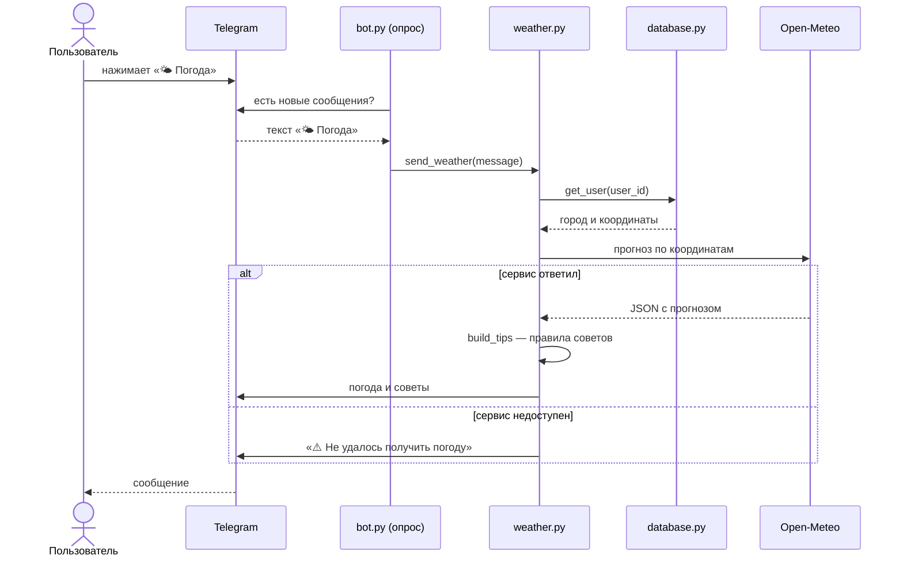
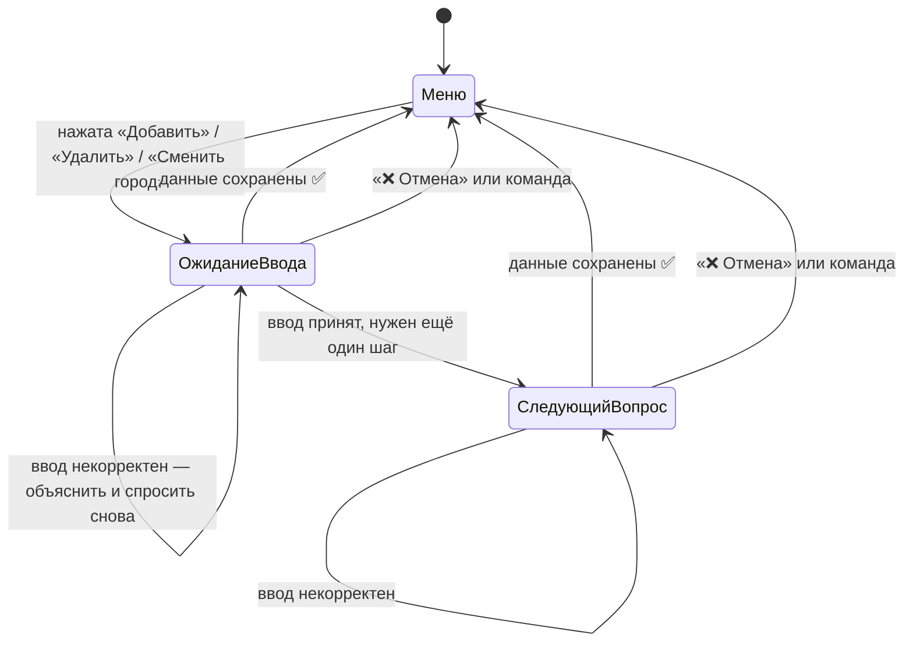
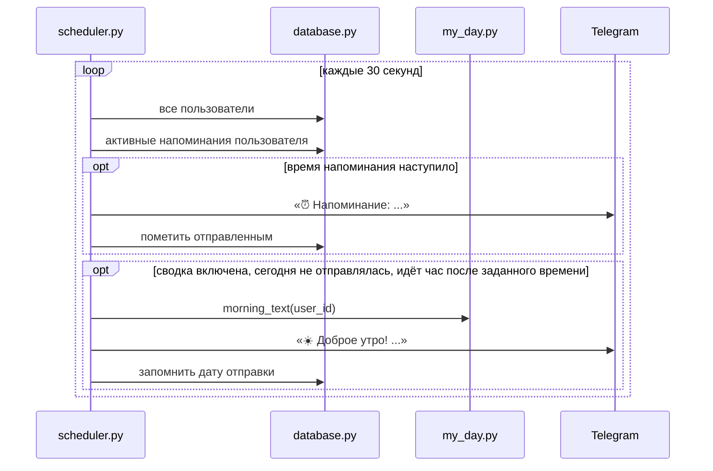
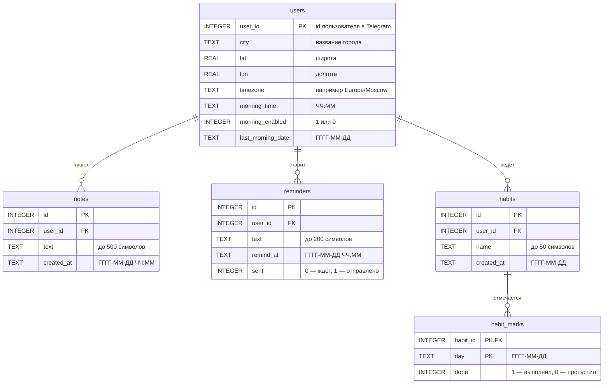

# Описание архитектуры

Как устроен Telegram-бот «Личный помощник» изнутри: из каких частей состоит, как они общаются и где лежат данные.

## Содержание

- [Общая идея](#общая-идея)
- [Технологии](#технологии)
- [Модули](#модули)
- [Схема компонентов](#схема-компонентов)
- [Как обрабатывается нажатие кнопки](#как-обрабатывается-нажатие-кнопки)
- [Как работают диалоги ввода](#как-работают-диалоги-ввода)
- [Фоновый поток](#фоновый-поток)
- [База данных](#база-данных)
- [Работа со временем](#работа-со-временем)
- [Обработка ошибок](#обработка-ошибок)
- [Безопасность](#безопасность)
- [Принятые решения](#принятые-решения)

## Общая идея

Бот — одна программа на Python, которую запускают командой `python bot.py`. Внутри неё работают два потока:

1. **Основной** постоянно спрашивает у Telegram, нет ли новых сообщений (long polling), и отвечает на них.
2. **Фоновый** раз в 30 секунд заглядывает в базу и отправляет напоминания и утренние сводки, время которых пришло.

Сервер, домен и входящие соединения не нужны: бот сам ходит к Telegram, поэтому запускается на любом компьютере с интернетом.

## Технологии

| Что | Чем | Почему |
|---|---|---|
| Язык | Python 3.10+ | Простой синтаксис, всё нужное есть в стандартной библиотеке |
| Telegram | pyTelegramBotAPI | Обработчики — обычные функции, без `async/await` |
| Хранение | SQLite (`sqlite3` из стандартной библиотеки) | Один файл, не нужен сервер базы данных |
| HTTP-запросы | requests | Погода, курсы, поиск городов |
| Секреты | python-dotenv | Токен читается из файла `.env` |
| Часовые пояса | `zoneinfo` + tzdata | Время считается по городу пользователя |
| Погода и города | Open-Meteo | Бесплатно и без ключа, есть осадки с шагом 15 минут |
| Курсы валют | cbr-xml-daily.ru | Официальные курсы ЦБ РФ в JSON, без ключа |

## Модули

Каждый раздел меню — отдельный файл. Служебные части вынесены отдельно.

| Файл | За что отвечает |
|---|---|
| `bot.py` | Точка входа: `/start`, ответ на нераспознанные сообщения, запуск базы, фонового потока и опроса Telegram |
| `loader.py` | Создаёт единственный объект `bot`; останавливает запуск, если токена нет |
| `config.py` | Токен из `.env`, город по умолчанию, лимиты, таймаут запросов |
| `database.py` | Вся работа с SQLite: создание таблиц и функции чтения и записи |
| `keyboards.py` | Главное меню, кнопка отмены, кнопки под сообщениями, проверка отмены ввода |
| `weather.py` | Запрос прогноза, поиск города, правила «умных» советов |
| `currency.py` | Курсы ЦБ РФ и конвертер |
| `notes.py` | Заметки |
| `reminders.py` | Напоминания и разбор введённого времени |
| `habits.py` | Привычки, подсчёт статистики и серий |
| `my_day.py` | Сообщение «Мой день» и текст утренней сводки |
| `settings.py` | Город, время и включение сводки |
| `scheduler.py` | Фоновый поток |

**Правило зависимостей.** Модули разделов знают про `loader`, `config`, `database`, `keyboards`, но не знают друг про друга. Исключения — сборные модули: `my_day.py` использует `weather` и `habits`, `settings.py` использует поиск города из `weather`, `scheduler.py` использует `my_day`. Файл `bot.py` импортирует всех и сам никем не импортируется, поэтому циклических зависимостей нет.

**Как подключаются обработчики.** Функция-обработчик помечается декоратором, например `@bot.message_handler(...)`. Декоратор срабатывает в момент импорта файла, поэтому строки `import weather`, `import notes` в `bot.py` — это и есть подключение разделов. Обработчик нераспознанных сообщений объявлен в `bot.py` после всех импортов: библиотека проверяет обработчики по порядку регистрации, и «ловушка для всего остального» должна быть последней.

## Схема компонентов

## Как обрабатывается нажатие кнопки

На примере кнопки «🌤 Погода»:

Кнопки главного меню отправляют обычный текст, поэтому обработчик выбирается по точному совпадению текста сообщения с текстом кнопки. Кнопки под сообщениями отправляют скрытую строку `callback_data` (например, `note_add` или `habit_done_12`), и обработчик выбирается по ней.

## Как работают диалоги ввода

Добавление заметки, напоминания, привычки, смена города и конвертер — это диалоги из нескольких шагов. Бот задаёт вопрос и вызывает `bot.register_next_step_handler(...)`: так он запоминает, какой функции отдать следующее сообщение этого пользователя.

Каждая функция шага устроена одинаково:

1. Если пришла отмена или команда — сообщить «Отменено.» и вернуть главное меню.
2. Проверить ввод. Если он не подходит — объяснить, что ожидается, и зарегистрировать эту же функцию ещё раз.
3. Если всё в порядке — сохранить данные и вернуть главное меню.

На время диалога главное меню заменяется одной кнопкой «❌ Отмена», чтобы пользователь случайно не отправил название раздела как текст заметки.

## Фоновый поток

`scheduler.start()` запускает функцию `loop()` в отдельном потоке-демоне: он не мешает основному потоку и завершается вместе с программой.

Три детали:

- **Один раз.** У напоминания есть флаг `sent`, у пользователя — дата последней сводки `last_morning_date`. Поэтому повторная проверка через 30 секунд ничего не отправит второй раз.
- **Окно в один час.** Сводка уходит, только если с заданного времени прошло меньше часа. Без этого новый пользователь, написавший боту в 15:00, тут же получил бы «Доброе утро».
- **Живучесть.** Тело цикла обёрнуто в `try/except`: любая ошибка печатается в консоль, и через 30 секунд поток пробует снова. Если Telegram отказал в доставке (например, пользователь заблокировал бота), напоминание всё равно помечается отправленным, чтобы не застревать на нём навсегда.

## База данных

Файл `bot.db` создаётся при первом запуске функцией `database.init_db()`.

- **Одна отметка в день.** У `habit_marks` составной первичный ключ «привычка + день», а запись делается командой `INSERT OR REPLACE`. Повторная отметка за тот же день заменяет предыдущую.
- **Даты хранятся текстом** в формате `ГГГГ-ММ-ДД ЧЧ:ММ`. Такие строки сравниваются как обычный текст и при этом идут в правильном порядке по времени, поэтому условие «время пришло» — это просто `remind_at <= сейчас`.
- **Соединение на каждый запрос.** Функция `database.run()` открывает соединение, выполняет один запрос и закрывает его. Это чуть медленнее, зато безопасно: основной и фоновый потоки никогда не делят одно соединение.
- **Подстановка параметров.** Значения передаются в запрос через `?`, а не склеиваются со строкой SQL, поэтому текст пользователя не может изменить запрос.

## Работа со временем

Всё время в боте — местное время города пользователя. При смене города сервис поиска возвращает его часовой пояс (например, `Asia/Vladivostok`), и он сохраняется в таблице `users`. Функция `database.user_now(user_id)` возвращает текущий момент в этом поясе; ею пользуются напоминания, привычки, «Мой день» и фоновый поток.

Поэтому напоминание «в 18:30» для пользователя из Владивостока сработает в 18:30 по Владивостоку, даже если программа запущена на компьютере в Москве.

Советы по погоде считаются от времени из ответа Open-Meteo — оно уже местное для запрошенных координат.

## Обработка ошибок

| Ситуация | Что происходит |
|---|---|
| Внешний сервис не ответил за 10 секунд или вернул ошибку | Исключение `requests.RequestException` перехватывается, пользователь получает сообщение со значком ⚠️ |
| Погода недоступна при сборке «Моего дня» или сводки | Вместо блока погоды — «Погода временно недоступна», остальное показывается |
| Некорректный ввод | Функция шага объясняет формат и спрашивает снова |
| Вместо текста пришли фото или стикер | В диалоге это считается пустым вводом; вне диалога бот отвечает «Не понял» |
| Ошибка в фоновом потоке | Печатается в консоль, поток продолжает работу |
| Нет токена в `.env` | `loader.py` печатает подсказку и завершает программу |
| Обрыв связи с Telegram | `bot.infinity_polling()` сам переподключается |

## Безопасность

- Токен хранится только в файле `.env`, который внесён в `.gitignore`. В репозитории лежит шаблон `.env.example` без значения.
- Файл базы `bot.db` тоже в `.gitignore` — данные пользователей не попадают в репозиторий.
- Других ключей у бота нет: оба внешних сервиса открытые.
- Данные пользователей разделены по `user_id`: каждый запрос к заметкам, напоминаниям и привычкам содержит условие по пользователю. Перед отметкой привычки бот проверяет, что она принадлежит нажавшему кнопку.
- SQL-запросы используют подстановку параметров.
- Длина пользовательских текстов и количество записей ограничены константами из `config.py`.

## Принятые решения

| Решение | Альтернатива | Почему так |
|---|---|---|
| Long polling | Webhook | Не нужны сервер с белым IP, домен и сертификат; запускается на ноутбуке |
| Синхронная библиотека | aiogram с `async/await` | Код читается сверху вниз как обычные функции; нагрузка учебного бота небольшая |
| SQLite | PostgreSQL | Не требует установки и настройки; для одного экземпляра бота достаточно |
| Собственный поток с циклом | Библиотека-планировщик | Двадцать строк понятного кода вместо ещё одной зависимости |
| Проверка раз в 30 секунд | Точный таймер на каждое напоминание | Переживает перезапуск: пропущенные напоминания отправляются после старта |
| Плоская структура файлов | Пакеты и подпапки | Один раздел — один файл, легко найти нужное место |
| Open-Meteo и курсы ЦБ без ключей | Сервисы с регистрацией | Единственный секрет в проекте — токен бота |

**Известные ограничения:**

- Состояние незавершённого диалога хранится в памяти: после перезапуска бота начатый ввод нужно начать заново. Сохранённые данные при этом не теряются.
- Один экземпляр на токен: два одновременно запущенных бота с одним токеном мешают друг другу.
- Осадки с шагом 15 минут точнее всего для Центральной Европы и Северной Америки; для остальных регионов Open-Meteo получает их из почасового прогноза.
